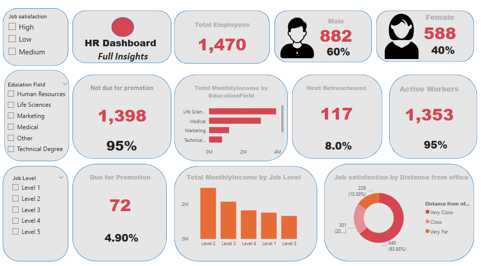

# Project 1

**Title:** [Siemens Automation Sales Performance Dashboard 2024/2025](https://github.com/oparinu/oparinu.github.io/blob/main/Dashboard.xlsx)

**Tools Used:** Microsoft excel (pivot table, pivot chart, slicers, conditional format, timeline)

**Project Description:**

**Key findings:**

**Dashboard Overview:**

# Project 2

**Title:** Football Data-Data Interrogation and Manipulation

**SQL Code:** [Football Players Data SQL Code](https://github.com/oparinu/oparinu.github.io/blob/main/SQL%20FOOTBALL%20DATA)

**SQL Skills Used:** 
Data Retrieval (SELECT): Queried and extracted specific information from the database.
Data Aggregation (SUM, COUNT): Calculated totals, such as sales and quantities, and counted records to analyze data trends.
Data Filtering (WHERE, BETWEEN, IN, AND): Applied filters to select relevant data, including filtering by ranges and lists.
Data Source Specification (FROM): Specified the tables used as data sources for retrieval
has context menu

**Project Description:**
 
**Technology used:** SQL server

# Project 3

**Title:** [HR Dashboard Full Insights](https://github.com/oparinu/oparinu.github.io/blob/main/HR%20Dashboard.pbix)

**Tools Used:** PowerBI (Matrix, KPI Cards, slicers, Visiual level formatting, filters)

**Project Description:** This projects provides a comprehensive overview of key performance metrics related to employee retention, satisfaction and productivity.

The dashboard enables stakeholders to track and analyze essential HR indicators including job satisfaction, performance ratings, workforce demographics and compensation trends. With interactive insights, it supports informed decision-making and strategic planning to enhance employee engagment and organizational performance.

Key features of the dashboard includes the total number of employees and gender breakdown by counts and percentages. it presents visual insights into monthly income by job level and education field, revealing trends across different employees' segments. The dashboard also examines job satisfaction in relation to office distance, assessing the impact of daily commuting on employee engagement and well-being. It further shows the number of active workers and identifies employees due and not due for promotion.

Additionally, the dashboard includes Interactive slicers to filter data by job satisfaction, job level, and education field enabling focused analysis and more targeted HR strategies. 

**Key findings:**

**Dashboard Overview:**

