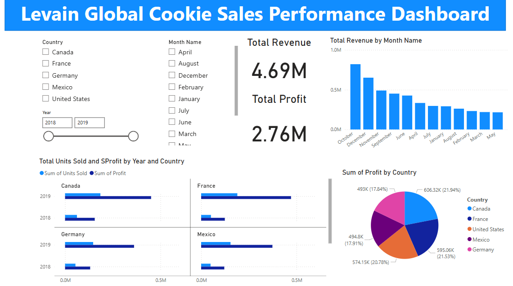

# Project 1

**Title:** [Siemens Automation Sales Performance Dashboard 2024/2025](https://github.com/oparinu/oparinu.github.io/blob/main/Dashboard.xlsx)

**Tools Used:** Microsoft excel (pivot table, pivot chart, slicers, conditional format, timeline)

**Project Description:**

**Key findings:**

**Dashboard Overview:**

# Project 2

**Title:** Football Data-Data Interrogation and Manipulation

**SQL Code:** [Football Players Data SQL Code](https://github.com/oparinu/oparinu.github.io/blob/main/SQL%20FOOTBALL%20DATA)

**SQL Skills Used:** 
Data Retrieval (SELECT): Queried and extracted specific information from the database.
Data Aggregation (SUM, COUNT): Calculated totals, such as sales and quantities, and counted records to analyze data trends.
Data Filtering (WHERE, BETWEEN, IN, AND): Applied filters to select relevant data, including filtering by ranges and lists.
Data Source Specification (FROM): Specified the tables used as data sources for retrieval
has context menu

**Project Description:**
This project analysed a dataset of professional football players using SQL queries to gain insights into various player attributes. The goal was to explore and filter data based on criteria such as position, height, weight, age, college, and team affiliation. Specific queries were used to identify players by team, filter by physical characteristics, and calculate statistics like average height by position. This analysis aimed to improve data-driven decision-making for team management, scouting, and performance assessment. By leveraging SQL, the project enabled efficient data extraction and provided actionable insights for understanding player profiles and trends.
 
**Technology used:** SQL server

# Project 3

**Title:** [HR Dashboard Full Insights](https://github.com/oparinu/oparinu.github.io/blob/main/HR%20Dashboard.pbix)

**Tools Used:** PowerBI (Matrix, KPI Cards, slicers, Visiual level formatting, filters)

**Project Description:** This projects provides an overview of key performance metrics related to employee retention, satisfaction and productivity.

The dashboard enables stakeholders to track and analyze essential HR indicators including job satisfaction, performance ratings, workforce demographics and compensation trends. With interactive insights, it supports informed decision-making and strategic planning to enhance employee engagment and organizational performance.

Key features of the dashboard include the total number of employees and gender breakdown by counts and percentages. it presents visual insights into monthly income by job level and education field, revealing trends across different employee segments. The dashboard also examines job satisfaction with office distance, assessing the impact of daily commuting on employee engagement and well-being. 

It further shows the number of active workers and identifies employees due and not due for promotion.

Additionally, the dashboard includes Interactive slicers to filter data by job satisfaction, job level, and education field enabling focused analysis and more targeted HR strategies. 

**Key findings:** 

**Commute Distance Affects Job Satisfaction:** Revealed that those who live very close to the office have higher job satisfaction than those with longer commutes. This suggests that offering remote work flexibility or commute related support could help boost overall satisfaction.

**Job Level and Education Impact Income:** Highlighted employees at higher job levels and those in specific education fields such as Life Sciences and Medicals consistently earn more, which can guide future training, upskilling or hiring strategies. 

**Promotion Tracking Aids Retention Planning:** Identified employees who are due and not yet due for promotion, allowing HR to proactively manage career progression, reducing attrition and improving engagement among high-potential staff.

**Dashboard Overview:**

# Project 4

**Title:** [Tata operational metrics Dashboard 2024/2025](https://github.com/oparinu/oparinu.github.io/blob/main/Tata_Dashboard.xlsx)

**Tools Used:** Microsoft excel (pivot table, pivot chart, slicers, conditional format, timeline)

**Project Description:** 
This project analyzed a comprehensive beverage dataset to identify trends and performance insights across various markets, states and product categories. The interactive dashboard enables stakeholders to monitor and evaluate product profitability, regional and market trends, cost efficiency, consumer preferences and the effectiveness of marketing startegies. 

The dashboard includes the following features:

**Budget Margin by Product and State:** It displays the budget margin for each product across different states, allowing stakeholders to assess profitability variations geographically.

**Sales Count by Product Type:** It provides a breakdown of sales volume by product type, helping to identify consumer preferences and demand patterns.

**Total Profit by Product Lines and States:** Visualizes the total profit generated by each product line within various states, providing insights into regional performance.

**Total Inventory by State:** Shows the overall inventory levels for all products in each state, supporting efficient inventory management and sales optimization.

**Key findings:**

**Budget Margin Variance Across States:** Some states consistently report higher budget margins for specific products, indicating more favourable cost to revenue ratios.

**Product Type Sales Trends:** Certain product types like coffee and Herbal Tea outperform others in sales volume, suggesting strong consumer preferences.

**Profit Distribution by Product Line and State:** Product lines such as Espresso and Herbal Tea yield higher total profits in specific regions, showing where the products are most lucrative.

This dashboard serves as a crucial tool for Tata's management team, providing clear and actionable insights that support informed decision-making and strategic planning.

**Dashboard Overview:**

# Project 5

**Title:** Employee Details Data-Data Interrogation and Manipulation

**SQL Code:** [Employee Information Data SQL Code](https://github.com/oparinu/oparinu.github.io/blob/main/SQL%20EMPLOYEE_DETAILS)

**SQL Skills Used:** 

Data Retrieval using SELECT to extract employee details, project names, and salary information from the database. 
Data Aggregation was performed using functions like MAX, MIN, AVG, and COUNT to calculate the maximum, minimum, and average salaries, as well as to count the number of employees assigned to specific projects. 
Data Filtering was achieved using WHERE, BETWEEN, IN, AND, and OR clauses to select employees based on manager IDs, cities, salary ranges, and project assignments. 
Pattern Matching LIKE operator was used to find employee names that followed specific character patterns. 
Data source Specification was handled through the FROM clause to accurately select the EmployeeDetails and EmployeeSalary tables. 
Set Operations such as UNION were used to combine results from both tables when fetching employee IDs. 
Arithmetic Operations were applied to calculate total salaries by adding fixed salaries to their corresponding variable components.

**Project Description:** 
The project focused on two tables: EmployeeDetails and EmployeeSalary. It used SQL operations to retrieve employee information based on manager relationships, extracting distinct project names and counting employees assigned to specific projects. The tasks included calculating maximum, minimum, and average salaries and identifying employees within a specific salary range. Employees were filtered based on city and manager criteria, and logical operators were applied to combine multiple conditions. Total salaries were calculated by combining fixed and variable components. Wild character operators were used to search for specific name patterns, and union operations were performed to fetch employee IDs from both tables, showcasing the efficiency of SQL data handling and analysis capabilities.
 
**Technology used:** SQL server

# Project 6

**Title:** [Levain Global Cookie Sales Performance Dashboard](https://github.com/oparinu/oparinu.github.io/blob/main/Levain_Global_Dashboard.pbix)

**Tools Used:** PowerBI (Matrix, KPI Cards, slicers, Visiual level formatting, filters)

**Project Description:** This project provides an overview of cookie sales performance across countries and periods, focusing on key business metrics.

The interactive Power BI dashboard allows stakeholders to explore sales data through visual insights into revenue, profit, units sold, and market trends. It supports data-driven decision-making and strategic planning to improve profitability and operational efficiency.

Notable features include monthly revenue analysis and profit segmentation by country, highlighting seasonal fluctuations and regional contributions. The dashboard also presents unit sales and profit trends across years and geographic locations, revealing performance dynamics over time. High-level indicators such as total revenue and profit offer a concise snapshot of overall business outcomes.

The dashboard incorporates slicers for country, year, and month names to enhance analytical flexibility. This enables users to easily filter results and conduct targeted analyses.

**Key findings:** 

**Revenue Peaks by Month:** Total revenue was highest during certain months, indicating strong seasonal demand for cookies, possibly during holidays or festive periods.

**Top-Performing Countries:** Certain countries consistently generated higher profits, revealing stronger markets and more effective sales channels in those regions.

**Profitability Trends by Year:** Profit margins improved year over year, suggesting better cost control or increased pricing efficiency.

**Unit Sales vs. Profitability:** Some countries had high unit sales but lower profits, highlighting potential issues with pricing strategies or higher production costs.

**Product Demand Variations:** Specific products showed stronger performance in certain regions or months, indicating opportunities for localized marketing and inventory planning.

**Dashboard Overview:**

