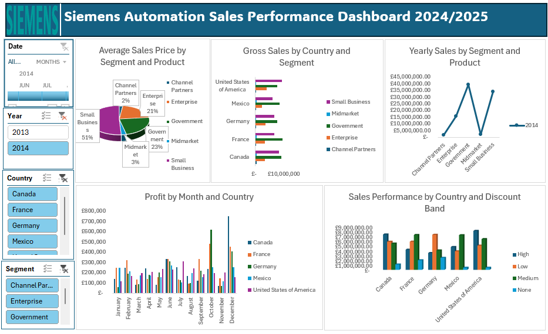

# Project 1

**Title:** [Siemens Automation Sales Performance Dashboard 2024/2025](https://github.com/oparinu/oparinu.github.io/blob/main/Dashboard.xlsx)

**Tools Used:** Microsoft excel (pivot table, pivot chart, slicers, conditional format, timeline)

**Project Description:**

**Key findings:**

**Dashboard Overview:**

# Project 2

**Title:** Football Data-Data Interrogation and Manipulation

**SQL Code:** [Football Players Data SQL Code](https://github.com/oparinu/oparinu.github.io/blob/main/SQL%20FOOTBALL%20DATA)

**SQL Skills Used:** 
Data Retrieval (SELECT): Queried and extracted specific information from the database.
Data Aggregation (SUM, COUNT): Calculated totals, such as sales and quantities, and counted records to analyze data trends.
Data Filtering (WHERE, BETWEEN, IN, AND): Applied filters to select relevant data, including filtering by ranges and lists.
Data Source Specification (FROM): Specified the tables used as data sources for retrieval
has context menu

**Project Description:**
 
**Technology used:** SQL server

