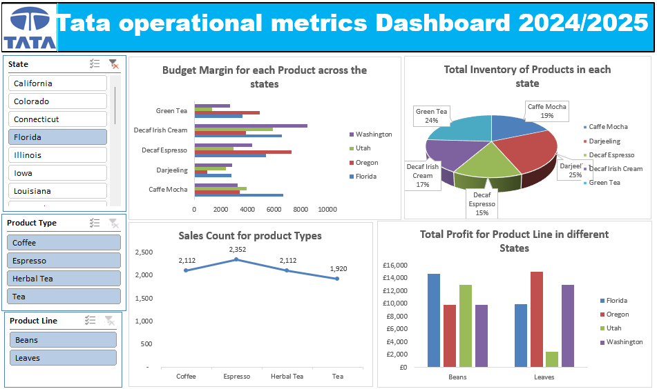

# Project 1

**Title:** [Siemens Automation Sales Performance Dashboard 2024/2025](https://github.com/oparinu/oparinu.github.io/blob/main/Dashboard.xlsx)

**Tools Used:** Microsoft excel (pivot table, pivot chart, slicers, conditional format, timeline)

**Project Description:**

**Key findings:**

**Dashboard Overview:**

# Project 2

**Title:** Football Data-Data Interrogation and Manipulation

**SQL Code:** [Football Players Data SQL Code](https://github.com/oparinu/oparinu.github.io/blob/main/SQL%20FOOTBALL%20DATA)

**SQL Skills Used:** 
Data Retrieval (SELECT): Queried and extracted specific information from the database.
Data Aggregation (SUM, COUNT): Calculated totals, such as sales and quantities, and counted records to analyze data trends.
Data Filtering (WHERE, BETWEEN, IN, AND): Applied filters to select relevant data, including filtering by ranges and lists.
Data Source Specification (FROM): Specified the tables used as data sources for retrieval
has context menu

**Project Description:**
 
**Technology used:** SQL server

# Project 3

**Title:** [HR Dashboard Full Insights](https://github.com/oparinu/oparinu.github.io/blob/main/HR%20Dashboard.pbix)

**Tools Used:** PowerBI (Matrix, KPI Cards, slicers, Visiual level formatting, filters)

**Project Description:** This projects provides an overview of key performance metrics related to employee retention, satisfaction and productivity.

The dashboard enables stakeholders to track and analyze essential HR indicators including job satisfaction, performance ratings, workforce demographics and compensation trends. With interactive insights, it supports informed decision-making and strategic planning to enhance employee engagment and organizational performance.

Key features of the dashboard include the total number of employees and gender breakdown by counts and percentages. it presents visual insights into monthly income by job level and education field, revealing trends across different employee segments. The dashboard also examines job satisfaction with office distance, assessing the impact of daily commuting on employee engagement and well-being. 

It further shows the number of active workers and identifies employees due and not due for promotion.

Additionally, the dashboard includes Interactive slicers to filter data by job satisfaction, job level, and education field enabling focused analysis and more targeted HR strategies. 

**Key findings:** 

**Commute Distance Affects Job Satisfaction:** Revealed that those who live very close to the office have higher job satisfaction than those with longer commutes. This suggests that offering remote work flexibility or commute related support could help boost overall satisfaction.

**Job Level and Education Impact Income:** Highlighted employees at higher job levels and those in specific education fields such as Life Sciences and Medicals consistently earn more, which can guide future training, upskilling or hiring strategies. 

**Promotion Tracking Aids Retention Planning:** Identified employees who are due and not yet due for promotion, allowing HR to proactively manage career progression, reducing attrition and improving engagement among high-potential staff.

**Dashboard Overview:**

# Project 4

**Title:** [Tata operational metrics Dashboard 2024/2025](https://github.com/oparinu/oparinu.github.io/blob/main/Tata_Dashboard.xlsx)

**Tools Used:** Microsoft excel (pivot table, pivot chart, slicers, conditional format, timeline)

**Project Description:** 
This project analyzed a comprehensive beverage dataset to identify trends and performance insights across various markets, states and product categories. The interactive dashboard enables stakeholders to monitor and evaluate product profitability, regional and market trends, cost efficiency, consumer preferences and the effectiveness of marketing startegies. 

The dashboard includes the following features:

**Budget Margin by Product and State:** It displays the budget margin for each product across different states, allowing stakeholders to assess profitability variations geographically.

**Sales Count by Product Type:** It provides a breakdown of sales volume by product type, helping to identify consumer preferences and demand patterns.

**Total Profit by Product Lines and States:** Visualizes the total profit generated by each product line within various states, providing insights into regional performance.

**Total Inventory by State:** Shows the overall inventory levels for all products in each state, supporting efficient inventory management and sales optimization.

**Key findings:**

**Budget Margin Variance Across States:** Some states consistently report higher budget margins for specific products, indicating more favourable cost to revenue ratios.

**Product Type Sales Trends:** Certain product types like coffee and Herbal Tea outperform others in sales volume, suggesting strong consumer preferences.

**Profit Distribution by Product Line and State:** Product lines such as Espresso and Herbal Tea yield higher total profits in specific regions, showing where the products are most lucrative.

This dashboard serves as a crucial tool for Tata's management team, providing clear and actionable insights that support informed decision-making and strategic planning.

**Dashboard Overview:**

